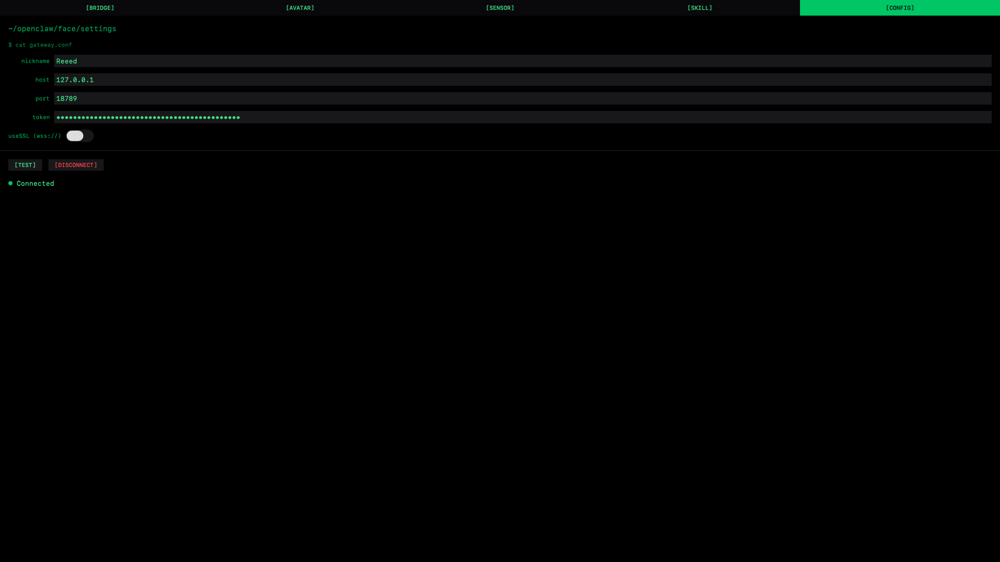
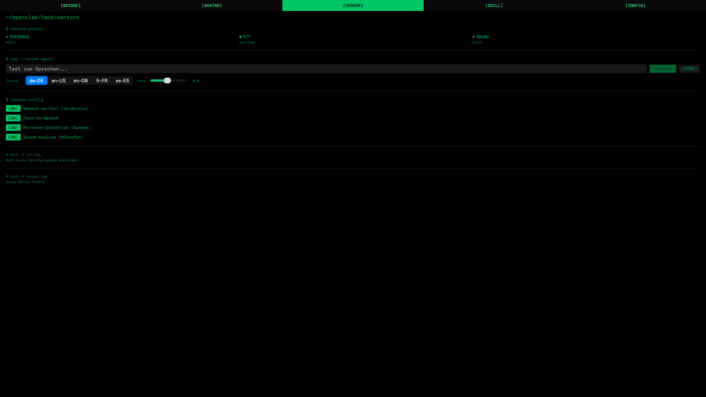
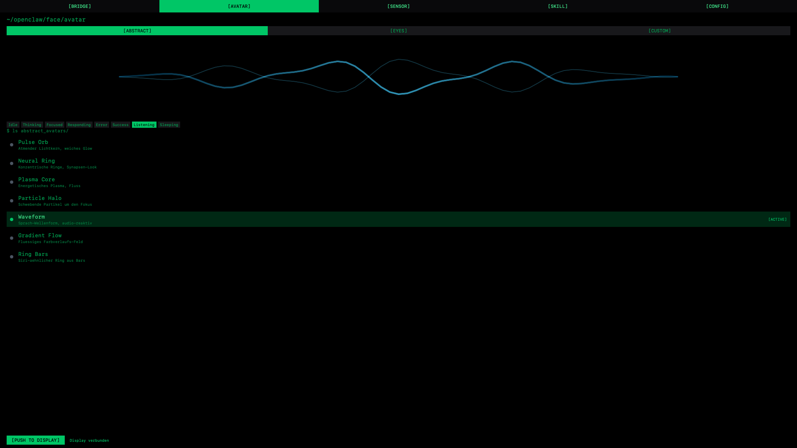

# ocMime — A Face for Your Local AI Agent

> **Work in progress. Rough edges expected. PRs and forks very welcome.**

ocMime gives your locally-running [OpenClaw](https://github.com/openclaw-engineering/openclaw) agent a visible face and a voice. A macOS bridge app speaks to the OpenClaw gateway over WebSocket; a companion iOS app turns an iPhone or iPad into a live face + sensor hub that listens, watches, and speaks back — all on-device.

```
   OpenClaw Gateway (Mac, port 18789)
            │
            │  WebSocket, Ed25519 device auth
            ▼
   ┌──────────────────────────┐
   │  OpenClawFace  (macOS)   │  ← bridge, dashboard, routing
   └────────────┬─────────────┘
                │  Bonjour (LAN), length-prefixed JSON
                ▼
   ┌──────────────────────────┐
   │  OpenClawDisplay  (iOS)  │  ← face + mic + camera + speaker
   └──────────────────────────┘
```

## Screenshots

<table>
<tr>
<td width="33%"></td>
<td width="33%"></td>
<td width="33%"></td>
</tr>
<tr>
<td align="center"><sub><b>CONFIG</b> — gateway host / token, live connection status</sub></td>
<td align="center"><sub><b>SENSOR</b> — voice I/O, camera, sound classifier, live logs</sub></td>
<td align="center"><sub><b>AVATAR</b> — seven abstract styles, push live to iPad</sub></td>
</tr>
</table>

## What you get today

**Working, on real hardware:**

- Auto-discovery between Mac and iPad over Bonjour (LAN or USB), with path-monitor + sleep/wake recovery.
- Live emotion display (8 states) driven by Gateway chat/status events and by inline `[emotion:*]` markers the agent can write into its own replies.
- On-device STT (SFSpeechRecognizer) streaming partial + final transcripts back to the bridge.
- STT → agent: voice input is forwarded as a `chat.send` RPC to the agent you pick in the SKILL tab.
- Agent reply → TTS: when the agent finalises a response, the iPad speaks it via AVSpeechSynthesizer.
- Mic mute during TTS playback — avoids the speaker-to-mic feedback loop.
- Two avatar systems, both pure SwiftUI / Canvas, no external assets:
  - **Abstract** — seven procedural styles (pulse orb, neural ring, plasma core, particle halo, waveform, gradient flow, ring bars).
  - **Custom** — a Bezier-based face composed of eyes, brows, pupils, mouth, nose, outline and accessories, each with variants + colour + size.
- Presence detection via Vision (front camera) and sound classification via SoundAnalysis — plumbed end-to-end but less battle-tested than the voice loop.
- Display-always-on while the app is foregrounded.

**Known rough spots:**

- No onboarding flow — first run needs you to enter gateway host/port/token manually in the CONFIG tab.
- No multi-slot avatar save. The Custom editor keeps one live config; exporting/importing isn't done.
- Device pairing with the gateway isn't handled in-app — the bridge assumes the gateway will accept a fresh Ed25519 public key under the `openclaw-macos` client id. If your gateway is stricter, see `GatewayService.swift` and be ready to modify.
- OpenClaw's chat RPC shape is exposed as three editable fields (method / id param / text param) because it has moved before and will move again. Defaults target the current `chat.send` / `sessionKey` / `message` schema.
- Presence + sound sensors don't have a polished UX for consent or tuning yet.
- No test suite. If you want to contribute coverage, that's probably the highest-leverage contribution.

## What you need

| | |
|---|---|
| Mac | macOS 14+, Xcode 16+ |
| iPhone / iPad | iOS 17+, same Wi-Fi as the Mac (or USB-tethered) |
| OpenClaw | A local gateway reachable at host/port of your choice (default `localhost:18789`) |
| Build | `xcodegen` (`brew install xcodegen`) |

## Setup

```bash
git clone https://github.com/<your-fork>/ocMime.git
cd ocMime
xcodegen generate
open OpenClawFace.xcodeproj
```

In Xcode, set your development team on both targets (Signing & Capabilities), then run:

- `OpenClawFace` → your Mac.
- `OpenClawDisplay` → your iPhone / iPad.

On macOS, open the `[CONFIG]` tab, enter your gateway's host, port (18789 by default) and bearer token, and hit `[CONNECT]`. On the iPad, launch the app — it will discover the Mac via Bonjour and start pulsating.

For a detailed end-to-end walkthrough (including the voice loop and common gotchas), see [`SETUP.md`](SETUP.md).

## Architecture

Two Xcode targets share `Shared/` via XcodeGen:

```
ocMime/
├── project.yml                 XcodeGen config — edit here, not in xcodeproj
├── Shared/
│   ├── Models/                 EmotionState, avatar configs, sensor commands
│   ├── Networking/             Gateway WS client, Bonjour framing, Keychain
│   ├── Renderer/               EmotionAnimator, face Shapes, Abstract canvas
│   └── Theme/                  Single source of truth for colour + typography
├── macOS/
│   ├── App/                    Entry point, 5-tab ContentView
│   ├── Services/               BonjourServer, EmotionRouter, SensorRouter, AgentTargetService
│   └── Views/                  Dashboard, Avatar editor, Sensor, Skill, Settings
└── iOS/
    ├── App/                    Entry point, wiring
    ├── Services/               BonjourClient, STT, TTS, Presence, SoundAnalysis, AudioSessionCoordinator
    └── Views/                  FaceView (fullscreen)
```

See [`CLAUDE.md`](CLAUDE.md) for a deeper, continually-updated architecture tour — it's also the brief an LLM-based contributor loads into context.

## Bonjour wire protocol

4-byte big-endian length header + JSON body over TCP.

**Mac → iPad**
```json
{"cmd":"emotion","state":"thinking","intensity":0.8,"context":"planning"}
{"cmd":"customAvatar","customAvatar":{...}}
{"cmd":"abstractAvatar","abstractAvatar":{"style":"pulseOrb"}}
{"cmd":"tts","ttsText":"Hallo!","context":"de-DE","intensity":0.5}
{"cmd":"ttsStop"}
{"cmd":"ping"}
```

**iPad → Mac**
```json
{"cmd":"stt","text":"Wie ist das Wetter?","isFinal":true,"locale":"de-DE"}
{"cmd":"presence","detected":true,"personCount":1,"confidence":0.92}
{"cmd":"sound","soundType":"knock","confidence":0.85}
```

## Contributing

This is a personal project released in the spirit of "maybe this is useful to someone, build on it if it is." I am not maintaining it as a polished product.

If you want to help:

- **Fork freely.** MIT-licensed.
- **Issues welcome** — especially reproducible bugs with your OpenClaw version noted.
- **PRs welcome** — small, focused ones are easier to merge. Preserve the terminal aesthetic (black / green monospace / `[BRACKETED]` buttons) and keep colours/fonts in `Theme.swift`.
- **Good first targets**: onboarding UI, multi-slot avatar save/export, tests for the Gateway/Bonjour layers, a better handling of OpenClaw RPC version drift.

If you build something on top, I'd love to see it — open an issue or a discussion on the repo.

## Related

- [OpenClaw](https://github.com/openclaw-engineering/openclaw) — the open-source AI agent framework this app orbits around.

## License

MIT. See [`LICENSE`](LICENSE).
